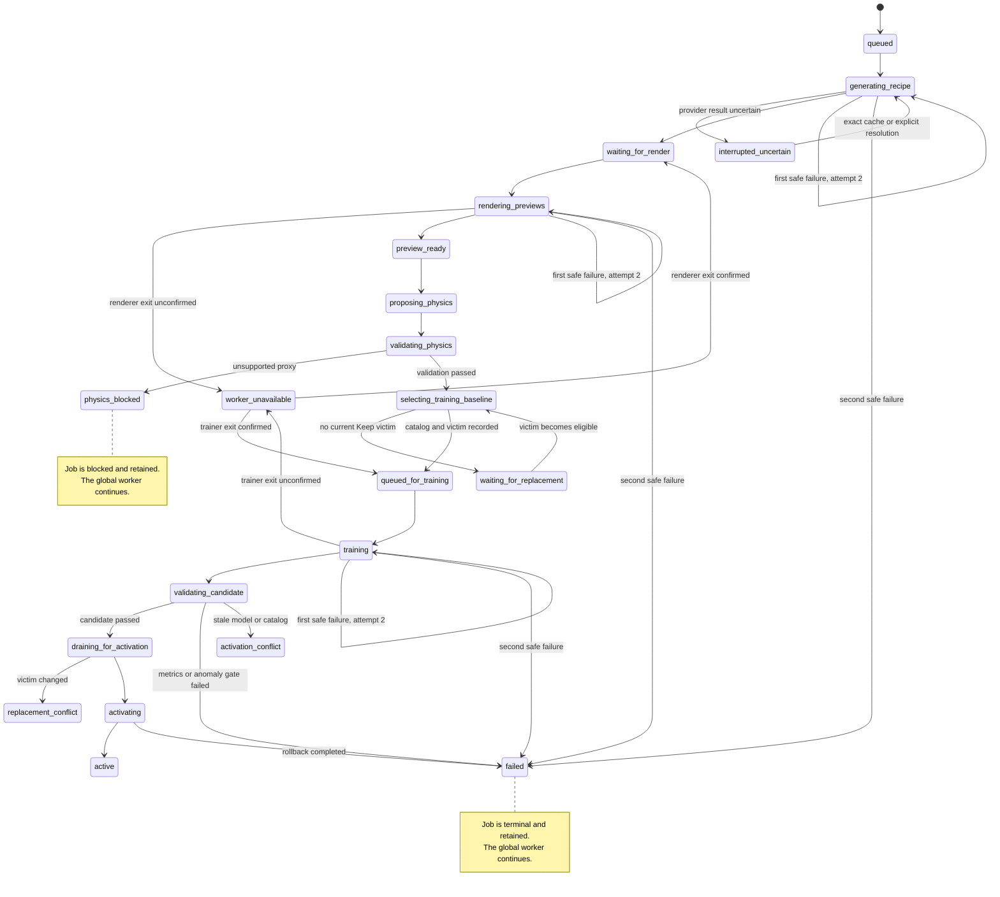

# CINTA generated-item controls implementation plan

## Overview

CINTA means Class-agnostic INline Transport Analyzer.

This plan covers a later generated-item increment. Current Keep and Reject controls remain a prerequisite and separate current work.

The later increment accepts several requests, generates previews, validates physics, trains one candidate, and activates one compatible type.

The active type count stays fixed. Each successful activation replaces the last active type whose current policy is `Keep`.

Generation, rendering, and training run outside the browser loop and live engine worker.

## Current contract and gap

- `profiles.py:15-78` defines `ClassSpec`, `Profile`, and every built-in type as Python data.
- `object_definitions.py:61-157` builds validated JSON-compatible drafts from recipes, GLB metadata, and physics proposals.
- `object_definitions.py:256-275` requires draft and unreviewed lifecycle states. It never constructs or registers `ClassSpec`.
- `classifier.py:92-116` stores one fixed ordered classifier label list inside each model artifact.
- `live.py:49-78` loads a Python profile and requires exact agreement between profile names, model labels, and manifest metadata.

Built-in and generated types do not currently use one active definition contract. Generated objects cannot load dynamically into the active profile.

The target design uses one validated data definition for built-in and generated types. A loader derives `ClassSpec` as an internal adapter.

The loader reads data files. It never imports generated Python.

## Terms

- **Python class**: `ClassSpec` is an implementation type. It is not an item identity or classifier category.
- **Object type**: `object_type_id` identifies immutable visual and physical semantics.
- **Classifier label**: one ordered model output name. A new label requires a compatible trained model.
- **Keep or Reject policy**: mutable handling for an active classifier label.
- **Physical truth**: defect and severity metadata. Policy changes do not rewrite this truth.

These concepts remain separate in storage, state, logs, and UI text.

## Ownership

Current runtime and UI owners finish the Keep and Reject prerequisite. Assign one future implementation owner when this generated-item increment starts.

That owner coordinates the loader, queue, training runner, service endpoints, and Items modal changes. Reviewers verify physics, model, and activation boundaries independently.

## Scope and non-goals

The plan introduces these capabilities:

- one shared filesystem definition and loader for built-in and generated types
- one visible shared queue inside the existing Items modal
- optional requester names and timestamps for every state change
- early preview renders before training finishes
- one background training job at a time
- automatic candidate training after physics validation
- automatic activation after compatibility validation
- fixed active type count with deterministic replacement
- atomic catalog, model, policy, session, and score-epoch activation

The plan does not provide these capabilities:

- arbitrary mesh physics without a supported contact proxy
- a new classifier label without retraining
- generated Python execution
- a database or task framework
- automatic paid-provider retries after uncertain work
- silent removal of a rejected type
- hot retyping or deletion of objects already on the belt

## Shared object definition

Add one versioned `ObjectTypeDefinition` JSON schema. Store built-in and generated definitions under one configured catalog root.

Each validated definition contains:

- immutable `object_type_id`, schema version, display name, and provenance
- one immutable classifier label for the candidate model
- feed prior and physical defect metadata
- visual shape, colour, texture, and sampled dimensions in metres
- supported engine contact proxy, density, and proxy-based mass basis
- content-hash `visual_asset_id`, GLB hash, units, axes, and pose correction
- lifecycle and validation status

The physics section accepts only contact-enabled shapes that the engine supports. Visual mesh metadata remains separate from collision metadata.

Physics dimensions and mass remain unmeasured estimates. The UI and stored definition label their proxy-based basis.

Before training, validate dimensions, density, mass, contact geometry, and finite numeric bounds together.

A seeded no-air route must reach `Accept` in the defined isolated machine fixture. This is a minimum compatibility gate, not a guarantee under every collision.

Representative load tests use the reviewed continuous preset. Their results do not guarantee acceptance for every feed interaction.

The existing draft builder can populate a draft definition. Only the shared loader can create an active `ClassSpec` adapter.

Migrate existing built-ins into data files without changing their values. Loader tests compare every derived field with the current Python definitions.

Store these catalog fields separately from each definition:

- `catalog_revision`
- `max_active_types`
- ordered `active_type_ids`
- active bundle hash

The active order defines replacement. The replacement victim is the last ordered active type whose current policy is `Keep`.

An activated type moves to the first position. Every surviving type keeps its relative order.

If no active type is `Keep`, the job enters `waiting_for_replacement`. The active bundle remains unchanged.

## Queue and persistence contract

Use the existing Items modal for queue state and the Add item entry point. Do not add another item-management surface.

The main page stays compact. The modal supports multiple users and shows the same server queue to every client.

Proposed endpoints:

```text
POST /item-jobs
{
  request_id: UUID,
  description: string,
  requester_name?: string,
  expected_catalog_revision: string
}

GET /item-jobs
GET /item-jobs/{request_id}
POST /item-jobs/{request_id}/resolve-provider
POST /item-jobs/{request_id}/resolve-replacement
```

Reuse the existing Host and Origin validation. Use exact request IDs and payload hashes for idempotency.

`expected_catalog_revision` validates admission only. The job binds to the latest catalog when training begins.

An exact retry returns the existing job. A changed payload returns `409 request_conflict`.

Keep at most four queued jobs and 32 summaries in the presentation buffer. Durable job files remain on disk.

Store each job under `<item_jobs_root>/jobs/<request_id>/`. Use atomic JSON replacement and one process-owned writer lock.

Store these files when available:

```text
job.json
request.json
definition.json
previews/
training/
activation/
```

`job.json` stores the requester, request hash, admission revision, training baseline, victim, artifacts, errors, and every state timestamp.

Use RFC 3339 UTC timestamps. Record creation, queue, start, preview, validation, training, activation, failure, and update times.

Persist these states:

```text
queued
generating_recipe
interrupted_uncertain
waiting_for_render
rendering_previews
worker_unavailable
preview_ready
proposing_physics
validating_physics
physics_blocked
selecting_training_baseline
queued_for_training
training
validating_candidate
waiting_for_replacement
draining_for_activation
activating
active
replacement_conflict
activation_conflict
failed
```



`physics_blocked`, `waiting_for_replacement`, `replacement_conflict`, and `activation_conflict` block only their job. The global worker continues later eligible jobs.

`failed` is terminal for that job. The retained job remains visible, and the global worker continues.

`worker_unavailable` blocks only work that needs the affected renderer or trainer. The live engine and unrelated queue stages continue.

`selecting_training_baseline` starts only after the job acquires the training turn. It records the latest catalog and current `Keep` victim immediately before training.

The service never auto-retries a provider request after an interrupted or uncertain call. A user must resolve that state.

Cached exact-request evidence can resume without billing. A new provider request requires a new explicit action.

Each safely retryable generation, rendering, or training stage has `max_attempts: 2`. Persist its attempt count across process and service restarts.

The second attempt is the only automatic retry. It applies to a renderer or trainer failure, or a generator failure proven to precede provider submission.

Never auto-retry when provider submission or billing is uncertain. Preserve `interrupted_uncertain` until exact cached evidence or an explicit new request resolves it.

An uncertain provider call never triggers or consumes an automatic billable retry. Any new paid request requires a new explicit user action.

Launch each renderer and trainer in its own process group. Persist its group ID, ownership token, and lease deadline.

Also persist the attempt count, provider submission status, timestamps, and terminal error.

On lease expiry, send `TERM` to the owned process group and wait for a bounded interval. Then send `KILL` and wait again if needed.

Confirm the complete process group exited before reassigning that renderer or trainer. Otherwise enter `worker_unavailable` and start no replacement process.

Only the current token may publish artifacts or state transitions. Reject stale output, but never use token fencing to authorize overlapping trainer or renderer processes.

A stalled job cannot block the queue indefinitely. Retain every failed job visibly after the single safe retry is exhausted.

Expose these errors without hiding the retained job:

```text
invalid_description
request_conflict
queue_full
credentials_missing
provider_interrupted
generation_failed
render_failed
worker_timeout
worker_unavailable
physics_unsupported
training_failed
candidate_validation_failed
replacement_conflict
activation_failed
```

## Items modal fields

Each compact queue row shows:

- preview thumbnail when available
- item name
- optional requester name
- short state and latest timestamp
- one primary action
- pending or short error cue

Collapsed details show:

- all state timestamps
- object, asset, request, catalog, and model identifiers
- replacement victim and active ordering
- dimensions, orientation, proxy, density, and proxy-based mass estimate
- physics validation evidence
- training progress, label order, metrics, and artifact hashes
- policy, model, session, and score epoch versions
- detailed error and recovery action

The existing class rows show only name, `Keep` or `Reject`, and pending or error cues.

IDs, severity, dimensions, evidence, and policy versions stay inside collapsed details.

The modal uses three item views:

- **Active**: current types with compact `Keep` or `Reject` controls
- **Queue**: generated-item jobs, previews, requester, progress, timestamps, failures, and recovery actions
- **Wall of Fame**: immutable inactive assets and provenance, loaded through bounded pages

The Wall of Fame shows newest entries first. It uses thumbnails and one selected rotating preview, not one WebGL context per card.

Inactive definitions remain read-only. Startup never promotes Wall of Fame entries into the active catalog.

## Replacement and activation rules

Queued generation does not bind a replacement victim. The job selects the latest victim when its training turn begins.

The training baseline records the current catalog revision, ordered active IDs, policy version, and last current `Keep` victim.

The candidate catalog order is the new type first, followed by surviving types in their existing relative order.

The candidate model trains with classifier labels in that exact final catalog order. Active type count remains fixed.

The victim must still be the last current `Keep` type before training and activation. Otherwise the job enters `replacement_conflict`.

No job selects a `Reject` type as a fallback victim. A user must confirm a new victim before retraining.

Generated artifacts and previews remain reusable after a victim conflict. Provider work does not repeat.

The activation command is serialized with `set_reject_policy`. It reads the latest policy inside the same worker boundary.

Activation preserves policy for every surviving label. It removes the victim and adds the new label as `Keep`.

An unrelated concurrent policy change remains intact. A changed victim or catalog revision blocks activation.

The activation bundle contains compatible catalog, model, manifest, preset, visual registry, policy, and source revisions.

The service rechecks the training baseline before activation. A changed catalog or victim creates `replacement_conflict` and requires a new training baseline.

The service validates the complete candidate in a separate process before it touches the active bundle pointer.

Activation creates a new model epoch, session, policy version, and score epoch. Old score rows never enter the new cohort.

The service pauses new spawning and lets current objects leave before restart. It never removes or retypes a live object.

A drain timeout cancels activation and resumes the old bundle. The UI shows the failure.

The existing service instance performs one coordinated worker restart. No second listener runs on the canonical port.

Failure before the old worker stops leaves its session and score epoch untouched.

Failure after the old worker stops restarts the prior bundle as a new session with a fresh score epoch.

Prior score rows remain historical evidence. The service does not claim score continuity without a proven complete checkpoint.

## Phase 1: Add the shared definition loader

### Changes

1. Add a small schema and loader module under `sim/coffee_sorter/`.
2. Use `sim/coffee_sorter/object_catalog/` as the default configurable catalog root.
3. Load exactly one validated active manifest from `<object_catalog_root>/active/catalog.json`.
4. Resolve active definitions only from `<object_catalog_root>/definitions/<object_type_id>.json` and their declared hashes.
5. Store inactive immutable assets under `<object_catalog_root>/wall-of-fame/<object_type_id>/`.
6. Store built-in definitions and active ordering as validated JSON data.
7. Archive each replaced type with its definition, GLB, previews, provenance, model evidence, and retirement timestamp.
8. Derive the existing `Profile` and `ClassSpec` adapters from loaded definitions.
9. Keep the draft generator separate from activation.
10. Reject unsupported proxies, duplicate IDs, duplicate labels, invalid units, and mismatched hashes.

The loader never scans arbitrary JSON for activation. Only the active manifest can select active definitions.

### Acceptance criteria

- Built-in simulations derive the same profile values as before migration.
- Built-in and generated definitions pass through one validator and loader.
- Draft or invalid definitions cannot enter an active catalog.
- Catalog length equals `max_active_types`.
- Model label order must equal active catalog label order.
- No definition file can execute Python.
- Replaced types remain available in bounded Wall of Fame pages without increasing the active type count.
- Restart loads only the validated active manifest. It never activates archived definitions.

### Verification

```sh
cd sim/coffee_sorter
/Users/taras/Documents/code/hackspain/.venv-coffee/bin/python -m unittest \
  test_object_catalog.py test_object_definitions.py test_generalization.py -v
/Users/taras/Documents/code/hackspain/.venv-coffee/bin/python -m py_compile \
  object_catalog.py object_definitions.py profiles.py
cd ../..
git diff --check
```

## Phase 2: Add the shared queue and early previews

### Changes

1. Add a filesystem-backed queue with exact-request idempotency and bounded presentation summaries.
2. Run recipe generation and rendering in child processes.
3. Publish compact queue summaries through the existing service state path.
4. Add queue rows and Add item controls inside the Items modal.
5. Expose previews as soon as validated renders exist.
6. Persist optional requester names and every transition timestamp.

### Acceptance criteria

- Rendering and generation do not run on the HTTP event loop or engine worker.
- Every connected client sees the same queue order, previews, progress, and errors.
- Exact retries never start a second provider request or render.
- Restart recovery never rebills uncertain provider work.
- A busy render lock stays visible as `waiting_for_render`.
- Queue and presentation limits appear in state and tests.
- Persisted stage counts permit at most two safe attempts per stage across restart.
- An expired lease cannot overlap a replacement renderer or trainer process.
- An unconfirmed process exit makes that worker unavailable until an operator confirms cleanup.
- A retained job without an unconfirmed process releases its worker and does not stop later eligible jobs.
- The compact main page remains unchanged outside the existing Items modal entry point.

### Verification

```sh
cd sim/coffee_sorter
/Users/taras/Documents/code/hackspain/.venv-coffee/bin/python -m unittest \
  test_item_jobs.py test_live.py test_object_definitions.py -v
/Users/taras/Documents/code/hackspain/.venv-coffee/bin/python -m py_compile \
  item_jobs.py live.py object_definitions.py
node --check live_web/live.js
cd ../..
git diff --check
```

Use fake provider and renderer adapters for retries, crashes, and queue limits. A real paid call still needs Taras's explicit authorization.

## Phase 3: Validate physics and train one candidate

### Changes

1. Validate dimensions, density, mass, contact geometry, supported shapes, and finite numeric bounds together.
2. Run a seeded no-air route in the defined isolated machine fixture before training.
3. Run representative load checks under the reviewed continuous preset after the isolated route passes.
4. Mark unsupported or invalid definitions as `physics_blocked` with actionable evidence.
5. Use a tracked ring fixture based on the existing Gemini earring visual asset.
6. Require `physics_unsupported` while the engine lacks an honest contact proxy for the ring opening.
7. Never describe a solid box or capsule approximation as measured ring physics.
8. Queue training automatically after physics validation succeeds.
9. Hold one filesystem training lease across all jobs.
10. Bind the latest catalog and last current `Keep` victim when the training turn begins.
11. Train labels in the exact final newest-first catalog order.
12. Validate holdout coverage, manifest hashes, preset compatibility, source provenance, and anomaly behavior.
13. Publish training progress and failures to the Items modal.

### Acceptance criteria

- At most one training process runs.
- Training never blocks browser rendering or the live engine worker.
- Unsupported geometry cannot enter training or activation.
- Physics estimates remain labelled as unmeasured proxy estimates.
- Candidate data includes every surviving label and the new label.
- A queued job uses the catalog that exists when its training turn begins.
- Generated beauty renders never count as classifier evidence.
- A later stale baseline blocks activation and requires retraining against the new baseline.
- Failed training leaves the active bundle untouched.
- The isolated no-air fixture reaches `Accept` without a jet before a supported definition becomes training-ready.
- The ring fixture stays blocked until a reviewed contact proxy represents its meaningful geometry.
- A newly allowed class must pass the active anomaly threshold as well as classifier-label checks.
- Candidate validation blocks routine anomaly rejection. It never hides the problem through an unreviewed threshold change.

A recognized Stone reached 99.9995% classifier confidence but still rejected because its anomaly score was `412.9917` above `15.6529`.

This result proves label compatibility alone is insufficient. Candidate validation must exercise both classifier and anomaly paths.

### Planned Phase 3 deliverables

Phase 3 adds `test_generated_physics.py`, `validate_object_route.py`, and both fixture definitions under `tests/fixtures/`.

The following commands become runnable after that implementation creates these files. This plan revision does not claim those validations ran.

### Verification

```sh
cd sim/coffee_sorter
/Users/taras/Documents/code/hackspain/.venv-coffee/bin/python -m unittest \
  test_item_jobs.py test_object_catalog.py test_generated_physics.py \
  test_generalization.py test_live.py -v
/Users/taras/Documents/code/hackspain/.venv-coffee/bin/python validate_object_route.py \
  --definition tests/fixtures/generated_ring/definition.json \
  --expect physics_unsupported
/Users/taras/Documents/code/hackspain/.venv-coffee/bin/python validate_object_route.py \
  --definition tests/fixtures/generated_box/definition.json \
  --preset configs/continuous_demo.json \
  --seed 8 --no-air --background-rate 0 --expect accept
/Users/taras/Documents/code/hackspain/.venv-coffee/bin/python bootstrap_model.py --help
cd ../..
git diff --check
```

Record independent holdout results, per-label coverage, and artifact hashes before candidate validation succeeds.

## Phase 4: Activate one compatible candidate

Activation makes one validated type available to the running sorter. It replaces one current `Keep` type and starts a matching catalog, model, policy, and score epoch.

Activation does not rewrite objects already on the belt. It does not activate failed, archived, or unsupported definitions.

### Changes

1. Build one immutable activation bundle from the validated candidate.
2. Recheck the catalog revision and last current `Keep` victim.
3. Confirm model labels exactly equal the final newest-first catalog order.
4. Preserve current policy for survivors and add the new label as `Keep`.
5. Drain existing objects without deleting or retyping them.
6. Replace the worker through one coordinated restart on the existing service port.
7. Publish new catalog, model, policy, session, and score epochs together.
8. Restore the prior bundle with a fresh rollback session when post-stop startup fails.

### Acceptance criteria

- Active type count remains exactly fixed.
- The new type appears first. Survivors preserve their relative order.
- A rejected type is never selected as an implicit victim.
- Concurrent policy changes for survivors remain intact.
- A stale victim or catalog produces a visible conflict.
- Exact activation retries do not create a second restart or epoch.
- Current objects resolve before restart.
- A pre-stop failure preserves the prior running session and score epoch.
- A post-stop rollback uses the prior bundle with a fresh session and score epoch.
- New scores start with an empty fresh epoch.

### Verification

```sh
cd sim/coffee_sorter
/Users/taras/Documents/code/hackspain/.venv-coffee/bin/python -m unittest \
  test_item_jobs.py test_continuous_engine.py test_live.py test_generalization.py -v
cd ../..
git diff --check
```

Verify queued baseline selection, exact label order, a stale victim, a concurrent policy change, and both rollback paths.

## Manual E2E

Use canonical port `8899`. Coordinate the existing instance replacement before starting the candidate service.

Never start a second listener on the port.

```sh
cd /Users/taras/Documents/code/hackspain
lsof -nP -iTCP:8899 -sTCP:LISTEN

# After the current owner confirms the coordinated stop:
.venv-coffee/bin/python sim/coffee_sorter/live.py \
  --port 8899 \
  --preset sim/coffee_sorter/configs/continuous_demo.json \
  --out /tmp/cinta-item-jobs \
  --item-jobs-root /tmp/cinta-item-jobs
```

Create one authorized job. The eventual implementation may perform a paid provider request.

```sh
REQUEST_ID=$(python3 -c 'import uuid; print(uuid.uuid4())')
curl --fail-with-body -X POST http://127.0.0.1:8899/item-jobs \
  -H 'Content-Type: application/json' \
  -H 'Origin: http://127.0.0.1:8899' \
  --data "{\"request_id\":\"$REQUEST_ID\",\"description\":\"A small brass star token\",\"requester_name\":\"Taras\",\"expected_catalog_revision\":\"<CURRENT_REVISION>\"}"
curl --fail http://127.0.0.1:8899/item-jobs/$REQUEST_ID
curl --fail http://127.0.0.1:8899/health
curl --fail http://127.0.0.1:8899/state
```

### Items modal checks

1. Open `http://127.0.0.1:8899` and open the existing Items modal.
2. Confirm **Active** shows every active type with `Keep` or `Reject` and a pending or error cue.
3. Confirm **Queue** shows the request, requester, preview, state, progress, timestamps, failure, and one primary action.
4. Confirm a selected item uses one rotating preview while cards use thumbnails.
5. Confirm **Wall of Fame** loads inactive entries in bounded pages and never changes the active count.
6. Submit the ring fixture and confirm it becomes `physics_blocked` with `physics_unsupported`.
7. Inject one safe renderer failure and confirm the single retry succeeds.
8. Inject two consecutive safe renderer failures and confirm a retained terminal failure.
9. Confirm the next queued job starts after the terminal failure.
10. Simulate an uncertain provider result and confirm no automatic retry or second billable request occurs.

### Deployment implications

The implementation updates `thoughts/taras/deployment/hack-growth.dev/README.md` before deployment.

The host needs a persistent writable catalog and job root. It also needs immutable active bundles, provider secrets, and bounded worker resources.

Generation, rendering, and training workers remain separate from the live engine worker. Paid Add item controls require the existing access and Origin checks.

Activation uses one coordinated replacement of the canonical `8899` service. Deployment never starts a duplicate listener.

The active manifest and Wall of Fame require backup and restore checks. Archived definitions remain inactive after restart.

Taras verifies these points:

1. The Items modal shows the shared queue, requester, timestamp, progress, and early previews.
2. The conveyor and scores continue during generation, rendering, and training.
3. A browser reconnect preserves one job and one provider request.
4. An interrupted or uncertain request never rebills automatically.
5. Valid supported physics starts one background training job automatically.
6. Unsupported physics stays visibly blocked without starting training.
7. Training progress and candidate evidence remain visible.
8. The UI identifies the last current `Keep` replacement before training.
9. A policy change that makes the victim `Reject` creates a visible replacement conflict.
10. Survivor policy changes remain intact after activation.
11. Activation drains existing objects and uses one coordinated restart.
12. The new type appears first as `Keep`, with the same total active type count.
13. A pre-stop failure preserves the previous running session and score epoch.
14. A post-stop failure restores the prior bundle with a fresh session and score epoch.
15. The activated session starts a fresh score epoch with matching model and policy versions.
16. The Active, Queue, and Wall of Fame views match the same server state.
17. A supported candidate passes the seeded no-air route and records representative load evidence.
18. Candidate evidence includes classifier-label and anomaly validation.

Taras owns final functional acceptance.
